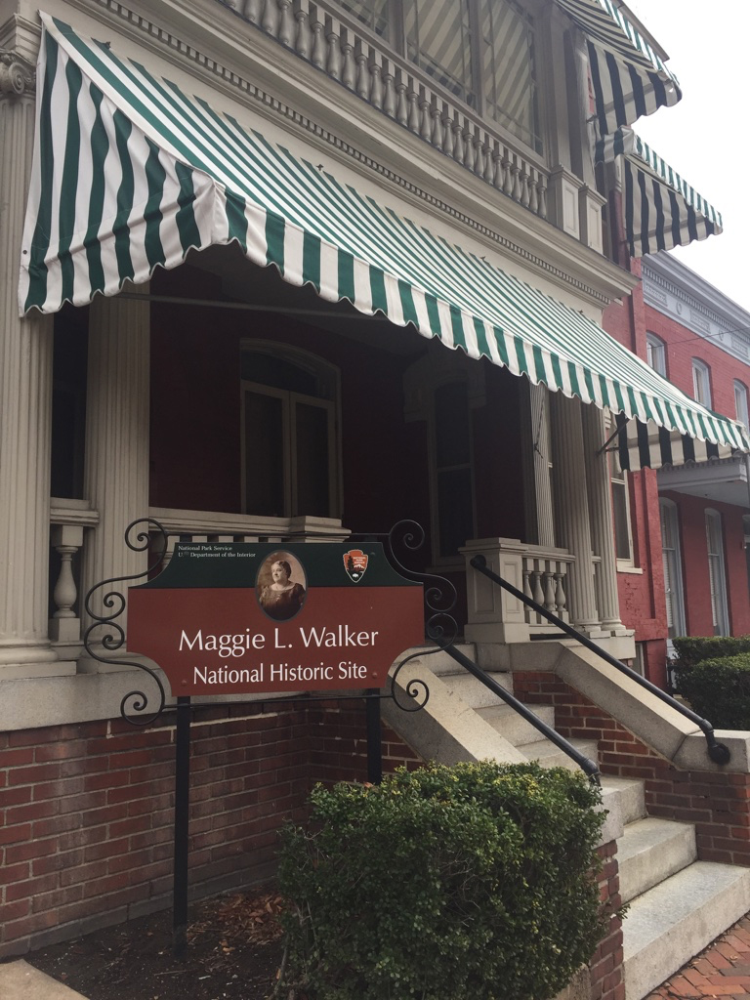

# Maggie's Daughters
A personal project about economic empowerment, celebrating the life and legacy of educator, philanthopist, and first woman bank President, Maggie L. Walker.
 
 

> Image from [Wikimedia](https://en.wikipedia.org/wiki/File:Maggie_L_Walker_Historic_Site.jpg)

 

# About Maggie Walker
As America struggled to regain its balance in the aftermath of the American Civil War, Maggie Lena Walker did her best to actively effect change by finding solutions to the social and economic problems facing socially disadvantaged groups, especially women and minorities. 

    
Read more...

Taking charge of the flailing Independent Order of St. Luke in 1899, Walker transformed the organization into a vibrant and thriving economic engine. With a vision of economic self-sufficiency, she established a newspaper in 1902, chartered the St. Luke Penny Savings Bank in 1903 becoming the first woman bank president in the United States. Throughout her life, Walker persevered and thrived despite personal, social and professional obstacles. [1] 

 

# About The Project
This project was birthed out the desire for economic education and empowerment, especially for societal groups that have been historically disadvantaged. What began as a desire to learn more about the fiancial industry and investments became a deep dive into the life and legacy of Maggie Lena Walker.   

    
Read more...

Maggie Walker was born shortly after the Civil War to a formerly enslaved woman who worked for a Union spy during the war and a former Confederate soldier. After Maggie's step-father, the man her mother would go on to marry, was found dead their family struggled financially and plunged into povery. After starting a laundry business her mother saw firsthand the economic gap and disparity between the people in her community and the laundry patrons she serviced in her business. This lit a fire in Maggie's mother that would lead her to instill in her own children a heart for service and empowerment through academic and economic advancement. 

 

# Resources
- [Project Data](https://docs.google.com/spreadsheets/d/17ygHkgbI0yy6Imhx7WOiZIPT9fL4LqEKgv00VMSSzzQ/edit?usp=sharing), *working document compiled by Stephanie N. Jones from various sources*
- [Virtual Tour of the Maggie Walker House](https://artsandculture.google.com/story/in-her-footsteps-a-virtual-tour-of-maggie-l-walker-s-home-maggie-l-walker-national-historic-site/8AXR_Z9D-zGYLw?hl=en), *Google Arts and Culture*
- [Glossary of Investment Terms](https://docs.google.com/document/d/12_STHHbEe2TcKPmh4M3txuj5x6bc05-CUMAJs6I6m7Q/edit?usp=sharing), *working document, compiled by Stephanie N. Jones from Investopedia*

# Project Plan
I began the project by collecting event data from various source (see Sources section) in a Google spreadsheet. I plan to tell the story of Maggie Walker through a timeline presentation using Google Sheets to collect the data, Jupyter Notebooks and Python to futher collect, clean, and prepare the data for exploration and visualization, and then a Tableau workbook and possibly Google Slides or Canva for presentation.  
1. Learn the story of Maggie Walker and collect data on key events in a Google Sheet document while also learning more about finance and, specifically investment
2. Read the data from the Google Sheet into a Pandas DataFrame using Python into a Jupyter Notbook
3. Clean the data and create a `wrangle.py` module to store functions that make the work reproducible.
4. Perform exploratory analysis and document key findings to be used in the presentation. Create an `explore.py` module to store functions that make the work reproducible.
    

    
<b>Click here for Initial Exploratory Questions</b>

        1. Can key events in Maggie's Walker's life be grouped in a meaningful way (e.g. Periods: Developmental, Learning, Working, Leaderhip, Retirement, etc.). I am recording the events and giving each event categories and sub-categories so looking at a frequency of categories by binned dates may uncover these insights.   
        2. Engineering a boolean feature that records an events as a positive or negative and determining how the frequency of positive and negatives may or may not have impacted milestones in her professional and personal life.   
        3. Looking at that same positive and negative events indicator, were there more positive/negative professional or personal events? (This is somewhat subjective, because we cannot know every event that happened in her life, only those that are documented and, for the purposes of this project, that I am capturing in this dataset)
    

5. Take conclusions and, using Tableau and/or Canva, create a presentation about Maggie's Walker's life and key takeways about her legacy.
 

## Steps to Reproduce
1. Step 1
2. Step 2
3. Step 3

 

Sources

1. Maggie Lena Walker and the Independent Order of St. Luke, *Harvard Business Review Case Study*, Anthony J. Mayo and Shandi O. Smith, November 25, 2008
2. 

